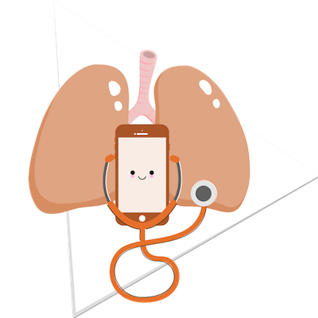
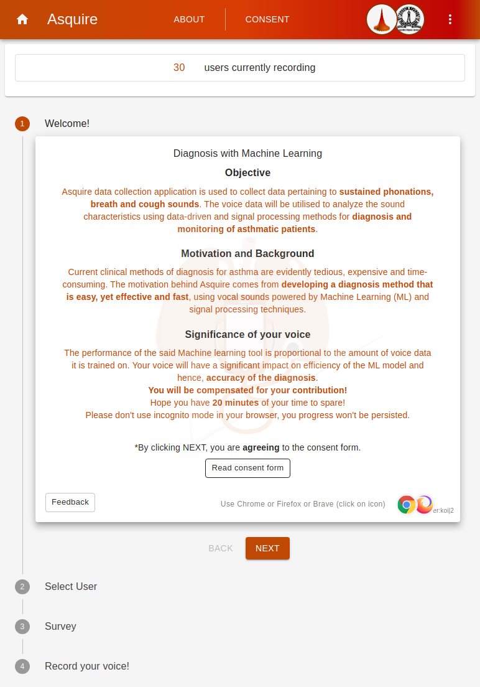
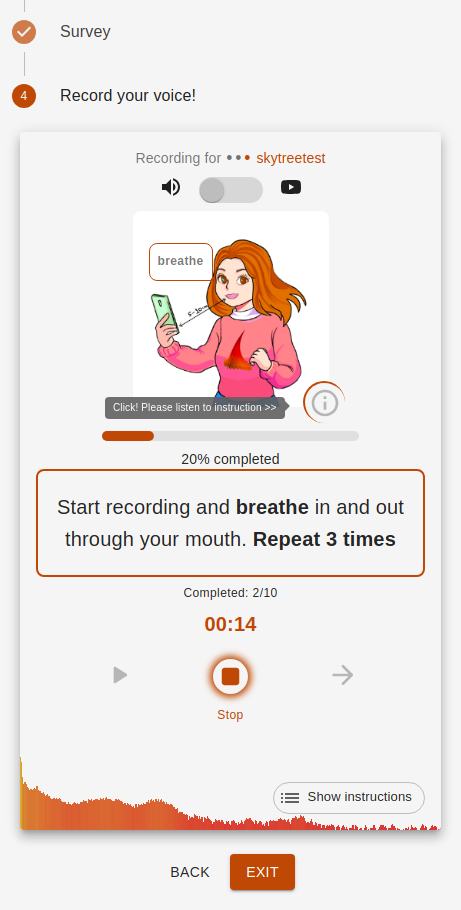
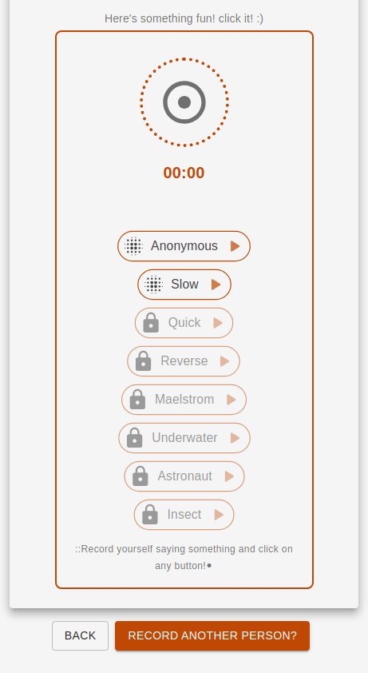

# Asquire 

Asquire is a data collection application designed to collect voice data related to sustained phonations, breath sounds, and cough sounds. The objective of this project is to analyze the sound characteristics of the collected voice data (recorded with smartphones) using data-driven and signal processing methods. The ultimate goal is to leverage machine learning (ML) techniques for the diagnosis and monitoring of asthmatic patients.

## Motivation and Background

The current clinical methods for diagnosing asthma are often tedious, expensive, and time-consuming. The `Asquire project` was developed with the motivation to provide an easy, effective, and fast diagnosis method for asthma using vocal sounds and ML algorithms. By utilizing the power of machine learning and signal processing techniques, this project aims to overcome the limitations of traditional diagnostic methods and provide a more efficient and accurate solution.

## How It Works

Asquire collects voice data from users through a web application. The users are instructed to perform sustained phonations, provide breath sounds, and cough sounds. The application then processes this voice data using data-driven and signal processing methods. Various sound characteristics such as frequency, intensity, duration, and patterns are extracted from the voice samples.

The processed voice data is then used to train a machine learning model. The ML model learns from the collected data to recognize patterns and associations between sound characteristics and asthma conditions. Once the model is trained, it can be used to analyze new voice samples and provide a diagnosis or monitoring feedback for asthmatic patients.

## Contribution and Significance of Your Voice

The performance of the machine learning tool developed in this project is directly proportional to the amount and quality of voice data it is trained on. Therefore, your voice contributions to the data collection process are crucial in improving the efficiency and accuracy of the ML model.

By providing your voice samples, you are helping to enhance the diagnostic capabilities of the system and contribute to the overall improvement of asthma diagnosis and monitoring. Your participation is invaluable in advancing the field of machine learning-based medical diagnostics.

## How to Contribute?
To contribute to the Asquire project, please follow these steps:

1. Visit the Asquire web-app <https://asquire.web.app>
2. Create a new user ID to get started.
3. Fill in your details and respond to the survey provided.
4. Proceed to the recording section and carefully follow the instructions to record your voice.
5. Once you have completed the recording, submit your data.
6. Our team will verify the submitted data, and for successful contributions, you will be compensated accordingly.
7. Bonus! There is a fun voice changing interface you can play with!

## Feedback and Support
If you encounter any issues, have suggestions for improvement, or need assistance, please feel free to reach out to our support team. You can contact us through <spire.vrx@gmail.com>, and we will be happy to assist you.

## Acknowledgements
We would like to express our gratitude to all the participants who generously provided their voice data for this project. Your contributions are vital in advancing the field of medical diagnostics and improving the lives of asthmatic patients. We would also like to acknowledge the open-source community for their invaluable contributions to the libraries and tools used in this project.

